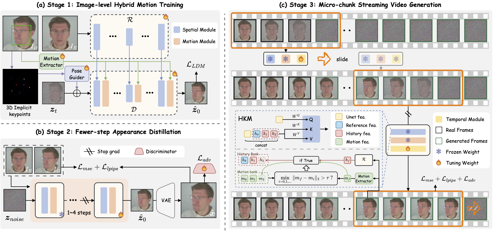
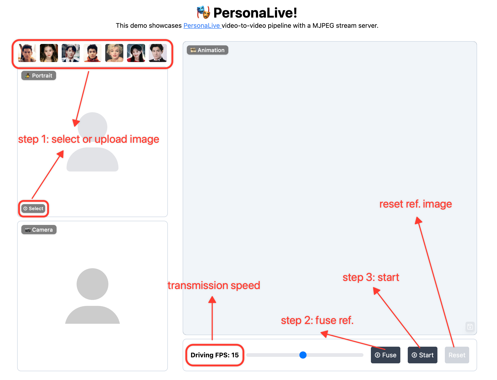

<div align="center">


<h2>Expressive Portrait Image Animation for Live Streaming</h2>

#### [Zhiyuan Li<sup>1,2,3</sup>](https://huai-chang.github.io/) · [Chi-Man Pun<sup>1,📪</sup>](https://cmpun.github.io/) · [Chen Fang<sup>2</sup>](http://fangchen.org/) · [Jue Wang<sup>2</sup>](https://scholar.google.com/citations?user=Bt4uDWMAAAAJ&hl=en) · [Xiaodong Cun<sup>3,📪</sup>](https://vinthony.github.io/academic/) 
<sup>1</sup> University of Macau  &nbsp;&nbsp; <sup>2</sup> [Dzine.ai](https://www.dzine.ai/)  &nbsp;&nbsp; <sup>3</sup> [GVC Lab, Great Bay University](https://gvclab.github.io/)

<a href='https://arxiv.org/abs/2512.11253'></a> <a href='https://huggingface.co/huaichang/PersonaLive'></a> <a href='https://modelscope.cn/models/huaichang/PersonaLive'></a> [](https://github.com/GVCLab/PersonaLive)


 &nbsp;&nbsp; 
</div>

## 📋 TODO
- [ ] If you find PersonaLive useful or interesting, please give us a Star🌟! Your support drives us to keep improving.
- [ ] Fix bugs (If you encounter any issues, please feel free to open an issue or contact me! 🙏)
- [x] **[2025.12.29]** 🔥 Enhance WebUI (Support reference image replacement).
- [x] **[2025.12.22]** 🔥 Supported streaming strategy in offline inference to generate long videos on 12GB VRAM!
- [x] **[2025.12.17]** 🔥 [ComfyUI-PersonaLive](https://github.com/okdalto/ComfyUI-PersonaLive) is now supported! (Thanks to [@okdalto](https://github.com/okdalto))
- [x] **[2025.12.15]** 🔥 Release `paper`!
- [x] **[2025.12.12]** 🔥 Release `inference code`, `config`, and `pretrained weights`!
  
## ⚖️ Disclaimer

- [x] This project is released for **academic research only**.
- [x] Users must not use this repository to generate harmful, defamatory, or illegal content.
- [x] The authors bear no responsibility for any misuse or legal consequences arising from the use of this tool.
- [x] By using this code, you agree that you are solely responsible for any content generated.

## ⚙️ Framework



We present PersonaLive, a `real-time` and `streamable` diffusion framework capable of generating `infinite-length` portrait animations.


## 🚀 Getting Started
### 🛠 Installation
```
# clone this repo
git clone https://github.com/GVCLab/PersonaLive
cd PersonaLive

# Create conda environment
conda create -n personalive python=3.10
conda activate personalive

# Install packages with pip
pip install -r requirements_base.txt
```

#### Google Colab (Free) 
```
git clone https://github.com/GVCLab/PersonaLive.git
cd PersonaLive

# Use Colab-specific pinned dependencies (CUDA 12.4)
pip install -r requirements_colab.txt

# If you want an external URL for the Web UI, install Node and run localtunnel via npx
apt-get update && apt-get install -y nodejs npm
npm install -g localtunnel
```

### ⏬ Download weights
Option 1: Download pre-trained weights of base models and other components ([sd-image-variations-diffusers](https://huggingface.co/lambdalabs/sd-image-variations-diffusers) and [sd-vae-ft-mse](https://huggingface.co/stabilityai/sd-vae-ft-mse)). You can run the following command to download weights automatically:
    
```bash
python tools/download_weights.py
```

Option 2: Download pre-trained weights into the `./pretrained_weights` folder from one of the below URLs:
    
<a href='https://drive.google.com/drive/folders/1GOhDBKIeowkMpBnKhGB8jgEhJt_--vbT?usp=drive_link'></a> <a href='https://pan.baidu.com/s/1DCv4NvUy_z7Gj2xCGqRMkQ?pwd=gj64'></a> <a href='https://modelscope.cn/models/huaichang/PersonaLive'></a> <a href='https://huggingface.co/huaichang/PersonaLive'></a>

Finally, these weights should be organized as follows:
```
pretrained_weights
├── onnx
│   ├── unet_opt
│   │   ├── unet_opt.onnx
│   │   └── unet_opt.onnx.data
│   └── unet
├── personalive
│   ├── denoising_unet.pth
│   ├── motion_encoder.pth
│   ├── motion_extractor.pth
│   ├── pose_guider.pth
│   ├── reference_unet.pth
│   └── temporal_module.pth
├── sd-vae-ft-mse
│   ├── diffusion_pytorch_model.bin
│   └── config.json
├── sd-image-variations-diffusers
│   ├── image_encoder
│   │   ├── pytorch_model.bin
│   │   └── config.json
│   ├── unet
│   │   ├── diffusion_pytorch_model.bin
│   │   └── config.json
│   └── model_index.json
└── tensorrt
    └── unet_work.engine
```

### 🎞️ Offline Inference
Run offline inference with the default configuration:

```
python inference_offline.py
```

* `-L`: Max number of frames to generate. (Default: 100)
* `--use_xformers`: Enable xFormers memory efficient attention. (Default: True)
* `--stream_gen`: Enable streaming generation strategy. (Default: True)
* `--reference_image`: Path to a specific reference image. Overrides settings in config.
* `--driving_video`: Path to a specific driving video. Overrides settings in config.

⚠️ Note for RTX 50-Series (Blackwell) Users: xformers is not yet fully compatible with the new architecture. To avoid crashes, please disable it by running:

```
python inference_offline.py --use_xformers False
```

### 📸 Online Inference
#### 📦 Setup Web UI
```
# install Node.js 18+
curl -o- https://raw.githubusercontent.com/nvm-sh/nvm/v0.39.1/install.sh | bash
nvm install 18

source web_start.sh
```

#### 🏎️ Acceleration (Optional)
Converting the model to TensorRT can significantly speed up inference (~ 2x ⚡️). Building the engine may take about `20 minutes` depending on your device. Note that TensorRT optimizations may lead to slight variations or a small drop in output quality.
```
# Install packages with pip
pip install -r requirements_trt.txt

# Converting the model to TensorRT
python torch2trt.py
```
💡 **PyCUDA Installation Issues**: If you encounter a "Failed to build wheel for pycuda" error during the installation above, please follow these steps:
```
# Install PyCUDA manually using Conda (avoids compilation issues):
conda install -c conda-forge pycuda "numpy<2.0"

# Open requirements_trt.txt and comment out or remove the line "pycuda==2024.1.2"

# Install other packages with pip
pip install -r requirements_trt.txt

# Converting the model to TensorRT
python torch2trt.py
```
⚠️ The provided TensorRT model is from an `H100`. We recommend `ALL users` (including H100 users) re-run `python torch2trt.py` locally to ensure best compatibility.

#### ▶️ Start Streaming
```
python inference_online.py --acceleration none (for RTX 50-Series) or xformers or tensorrt
```
Then open `http://0.0.0.0:7860` in your browser. (*If `http://0.0.0.0:7860` does not work well, try `http://localhost:7860`)

**How to use**: Upload Image ➡️ Fuse Reference ➡️ Start Animation ➡️ Enjoy! 🎉
<div align="center">
  
</div>

**Regarding Latency**: Latency varies depending on your device's computing power. You can try the following methods to optimize it:

1. Lower the "Driving FPS" setting in the WebUI to reduce the computational workload.
2. You can increase the multiplier (e.g., set to `num_frames_needed * 4` or higher) to better match your device's inference speed. https://github.com/GVCLab/PersonaLive/blob/6953d1a8b409f360a3ee1d7325093622b29f1e22/webcam/util.py#L73

## 📚 Community Contribution

Special thanks to the community for providing helpful setups! 🥂

* **Windows + RTX 50-Series Guide**: Thanks to [@dknos](https://github.com/dknos) for providing a [detailed guide](https://github.com/GVCLab/PersonaLive/issues/10#issuecomment-3662785532) on running this project on Windows with Blackwell GPUs.

* **TensorRT on Windows**: If you are trying to convert TensorRT models on Windows, [this discussion](https://github.com/GVCLab/PersonaLive/issues/8) might be helpful. Special thanks to [@MaraScott](https://github.com/MaraScott) and [@Jeremy8776](https://github.com/Jeremy8776) for their insights.
  
* **ComfyUI**: Thanks to [@okdalto](https://github.com/okdalto) for helping implement the [ComfyUI-PersonaLive](https://github.com/okdalto/ComfyUI-PersonaLive) support.

* **Useful Scripts**: Thanks to [@suruoxi](https://github.com/suruoxi) for implementing `download_weights.py`, and to [@andchir](https://github.com/andchir) for adding audio merging functionality.

## 🎬 More Results
#### 👀 Visualization results

<table width="100%">
  <tr>
    <td width="50%">
      <video src="https://github.com/user-attachments/assets/cdc885ef-5e1c-4139-987a-2fa50fefd6a4" controls="controls" style="max-width: 100%; display: block;"></video>
    </td>
    <td width="50%">
      <video src="https://github.com/user-attachments/assets/014f7bae-74ce-4f56-8621-24bc76f3c123" controls="controls" style="max-width: 100%; display: block;"></video>
    </td>
  </tr>
</table>
<table width="100%">
  <tr>
    <td width="25%">
      <video src="https://github.com/user-attachments/assets/1e6a0809-15d2-4cab-ae8f-8cf1728c6281" controls="controls" style="max-width: 100%; display: block;"></video>
    </td>
    <td width="25%">
      <video src="https://github.com/user-attachments/assets/d9cf265d-9db0-4f83-81da-be967bbd5f26" controls="controls" style="max-width: 100%; display: block;"></video>
    </td>
    <td width="25%">
      <video src="https://github.com/user-attachments/assets/86235139-b63e-4f26-b09c-d218466e8e24" controls="controls" style="max-width: 100%; display: block;"></video>
    </td>
    <td width="25%">
      <video src="https://github.com/user-attachments/assets/238785de-3b4c-484e-9ad0-9d90e7962fee" controls="controls" style="max-width: 100%; display: block;"></video>
    </td>
  </tr>
  <tr>
    <td width="25%">
      <video src="https://github.com/user-attachments/assets/c71c4717-d528-4a98-b132-2b0ec8cec22d" controls="controls" style="max-width: 100%; display: block;"></video>
    </td>
    <td width="25%">
      <video src="https://github.com/user-attachments/assets/7e11fe71-fd16-4011-a6b2-2dbaf7e343fb" controls="controls" style="max-width: 100%; display: block;"></video>
    </td>
    <td width="25%">
      <video src="https://github.com/user-attachments/assets/f62e2162-d239-4575-9514-34575c16301c" controls="controls" style="max-width: 100%; display: block;"></video>
    </td>
    <td width="25%">
      <video src="https://github.com/user-attachments/assets/813e7fbd-37e9-47d7-a270-59887fafeca5" controls="controls" style="max-width: 100%; display: block;"></video>
    </td>
  </tr>
</table>

#### 🤺 Comparisons

<table width="100%">
  <tr>
    <td width="100%">
      <video src="https://github.com/user-attachments/assets/36407cf9-bf82-43ff-9508-a794d223d3f7" controls="controls" style="max-width: 100%; display: block;"></video>
    </td>
  </tr>
  <tr>
    <td width="100%">
      <video src="https://github.com/user-attachments/assets/3be99b91-c6a1-4ca4-89e9-8fad42bb9583" controls="controls" style="max-width: 100%; display: block;"></video>
    </td>
  </tr>
  <tr>
    <td width="100%">
      <video src="https://github.com/user-attachments/assets/5bd21fe4-96ae-4be6-bf06-a7c476b04ec9" controls="controls" style="max-width: 100%; display: block;"></video>
    </td>
  </tr>
</table>


## ⭐ Citation
If you find PersonaLive useful for your research, welcome to cite our work using the following BibTeX:
```bibtex
@article{li2025personalive,
  title={PersonaLive! Expressive Portrait Image Animation for Live Streaming},
  author={Li, Zhiyuan and Pun, Chi-Man and Fang, Chen and Wang, Jue and Cun, Xiaodong},
  journal={arXiv preprint arXiv:2512.11253},
  year={2025}
}
```

## ❤️ Acknowledgement
This code is mainly built upon [Moore-AnimateAnyone](https://github.com/MooreThreads/Moore-AnimateAnyone), [X-NeMo](https://byteaigc.github.io/X-Portrait2/), [StreamDiffusion](https://github.com/cumulo-autumn/StreamDiffusion), [RAIN](https://pscgylotti.github.io/pages/RAIN/) and [LivePortrait](https://github.com/KlingTeam/LivePortrait), thanks to their invaluable contributions.
